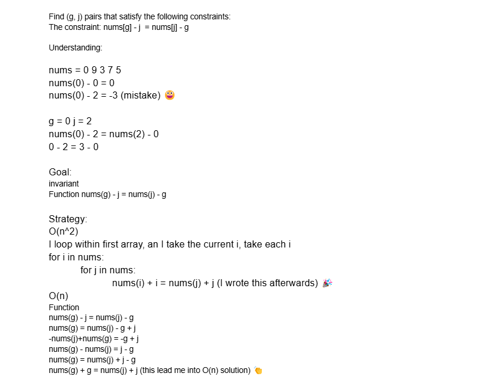

07/04/2025

This was my very first technical interview with live conding, 
the screenshot part is what actually happend during the interview.

The .py is the code I wrote afterwards to optimize the solution from O(n^2) to O(n) and O(n^2) in worst-case.